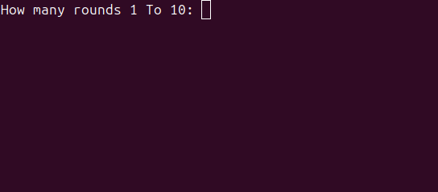
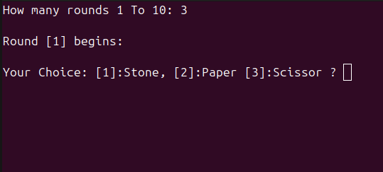
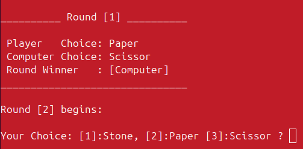
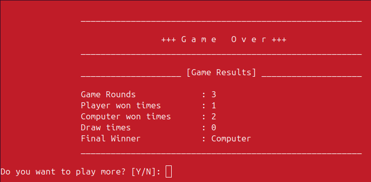

# Stone Paper Scissor Console Game
Is a simple traditional game play.

It built with C++ programming language, and on Linux OS.

## Instaling and Running: (Linux OS)

1. Take a clone of the project in your PC:  
You can just copy the following command and base in your terminal.
    ```
    git clone git@github.com:Ahmed101Mohammed/stone-paper-scissor.git
    ```
2. Go to the project source code using:  
The project source code will be located at ```src``` folder.
3. Run the project:  
Open the terminal and route to the ```src``` folder and then run the following
command:
    ```
    ./a.out
    ```

## How to play:-)
When the project run you will see this putiful screen:  
  

Then you can choose the number of rounds your want to play. I will choose 3 for
example.

Then the game started.  
  

As you can see you can choose your choice in each round. I will choose 
```Paper```.  
  
The computer defeated me :-( In the first round. And we start the round 2.  
After I plaied all the rounds This is the final result:  
  
As you can see the PC defeated me. So Will I give up?!  
Here After the game results printed, the game ask you if you want to play more. 
And if you say Yeah ```y```. You will start from the beginning again.